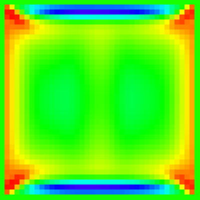

# p5.ten
> A p5.js addon library for computing with tensors

[](https://app.travis-ci.com/nickmcintyre/p5.ten)

## Usage

### Tensors
View the [matrix-vector example](/examples/matrix-vector/).
```javascript
const a = createTensor([[1, 2], [3, 4]]);
const x = createTensor([5, 6]);
const b = a.dot(x);

b.print();
```

## Demo

The [fluid simulation](/examples/fluid-simulation/) below was created using a 2-dimensional [lattice Boltzmann method](https://en.wikipedia.org/wiki/Lattice_Boltzmann_methods).


